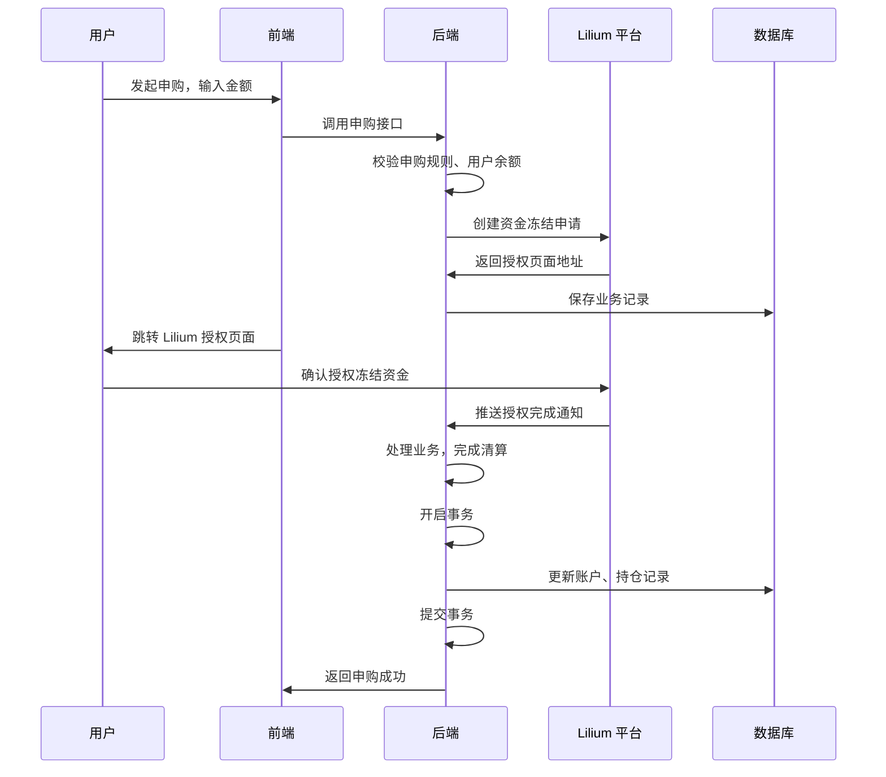
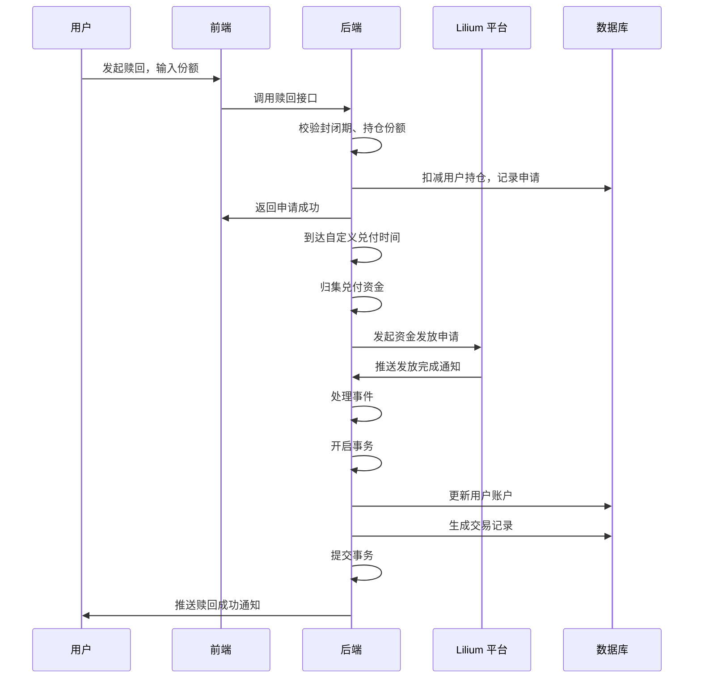
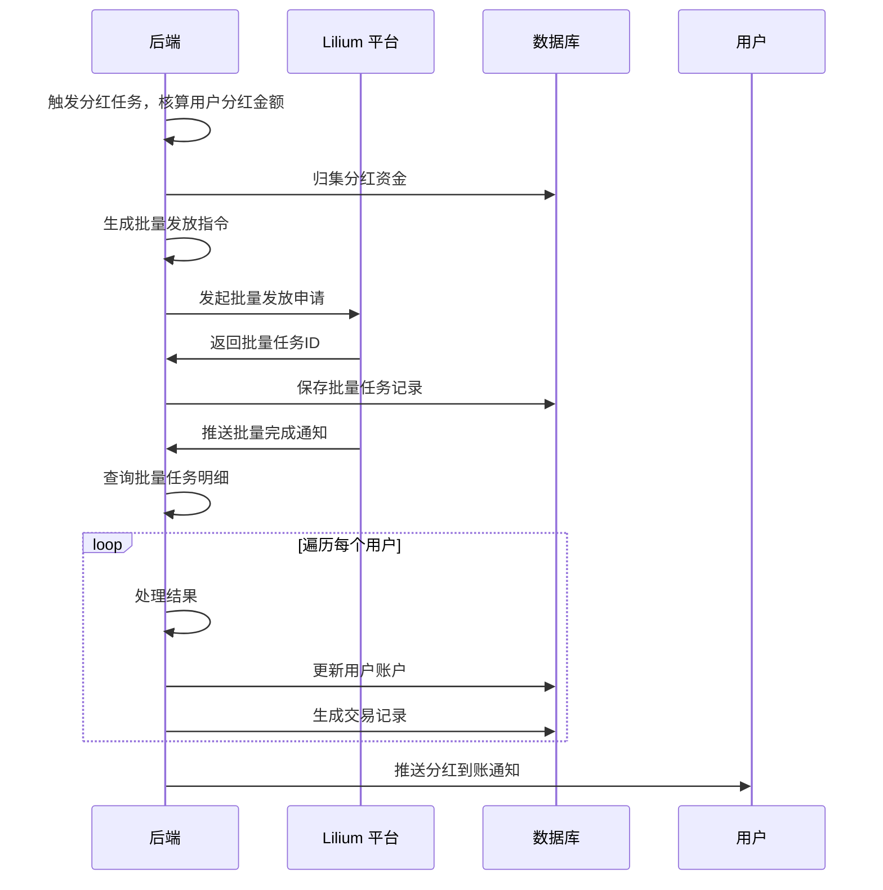

# 非标基金合作系统功能说明文档

## 文档说明

本文档为面向合作方的业务功能说明，用于介绍非标基金合作系统的核心能力、对接逻辑与技术支撑，帮助快速了解系统能力边界与合作价值。

---

## 一、系统核心定位

本系统为适配 Lilium 平台的非标基金业务系统，基于 Lilium 平台的认证与清算能力，自研全流程业务规则，解决 Lilium 单清算账户的架构限制，实现自定义的基金投资玩法。系统仅自主管控业务规则，所有用户鉴权、资金冻结、扣款、发放等基础能力均对接 Lilium 平台实现，严格遵循 Lilium 的平台风控与安全规范，可快速完成业务落地。

---

## 二、用户端核心功能

面向终端投资用户，提供完整的投资交互能力：

1. **基金产品浏览** 用户可查看全部在售基金产品，了解产品的风险等级、历史收益、封闭期、申购限额等信息，支持按需求筛选产品，快速找到适配的投资选择。

2. **基金申购** 用户可选择心仪的基金发起投资，系统自动校验申购规则，跳转 Lilium 平台完成资金授权，完成后自动记录用户的持仓份额，无需用户额外操作。

3. **基金赎回** 封闭期到期后，用户可发起赎回申请，系统按照自定义的到账规则自动处理，完成资金兑付后将资金发放到用户账户，用户可随时查看进度。

4. **自动分红** 系统支持自定义分红规则，可按周期、手动或资产回款触发分红，自动筛选符合条件的用户、核算每个用户的分红金额，批量完成资金发放，用户无需额外操作即可自动收到分红。

5. **资产与持仓查询** 用户可随时查看个人总资产、可用资金、冻结资金，以及持有的基金明细、收益情况，清晰掌握自身的投资状况。

6. **实时消息通知** 系统自动推送收益到账、赎回成功、分红到账、封闭期到期等通知，让用户及时了解业务动态，避免错过投资节点。

---

## 三、运营管理功能

面向运营人员，提供全流程的业务管理能力：

1. **产品与经理管理** 运营可自定义创建基金产品、配置基金经理，灵活设置产品的风险等级、封闭期、申购限额等规则，适配不同的业务场景需求。

2. **业务规则配置** 运营可可视化配置申购费率、赎回费率、涨跌概率、通胀阈值等规则，支持热更新，修改后实时生效，无需重启系统，可快速适配业务变化。

3. **数据监控与自动对账** 系统提供全服资金总量监控、业务数据统计报表，每日自动与 Lilium 平台完成资金对账，保证双方数据的一致性，异常数据自动告警，及时发现问题。

4. **异常处理与风控** 运营可查看处理失败的业务事件，支持手动重试修复；同时可配置用户黑名单，限制违规用户的投资权限，保障业务秩序。

---

## 四、平台对接说明

针对 Lilium 平台的适配与对接逻辑，无需平台额外调整规则：

1. **单账户适配** 针对 Lilium 单清算账户的限制，系统自研了内部主子账户隔离体系，实现多基金、多用户的资金隔离，对外仅使用 Lilium 的唯一主账户，完全适配平台的现有架构。

2. **双认证对接** 适配 Lilium 平台 OIDC 用户登录（授权码模式）与 OAuth2 client_credentials 服务端鉴权，用户侧通过 OIDC 完成登录，解析 sub 作为唯一用户标识；服务端调用 Lilium 接口时，通过 client_credentials 获取短期 Bearer Token，定时自动刷新，确保接口调用的有效性，严格遵循 Lilium 的认证规范。

3. **清算流程对接** 所有资金相关操作（冻结、扣款、发放、解冻）均对接 Lilium 清算 API 实现，申购时调用 payment-intent reserve 预冻结资金，申购成功后调用 commit 完成清算，赎回、分红时调用 payout 或批量 payout 完成资金发放，失败时调用 release 完成解冻，完全遵循 Lilium 清算流程与风控要求。

4. **Webhook 对接**监听 Lilium 平台 Webhook 回调，实时接收支付意图、清算指令、批量清算的状态变更，完成自身台账更新，同时对回调进行验签、时间偏差校验、事件去重，避免重复处理，确保数据一致性。

5. **幂等与安全适配** 所有 Lilium 写接口均携带 Idempotency-Key，避免重复下单扣款；所有 API 调用均使用 HTTPS，妥善保护 client_secret，不暴露至浏览器，严格遵循 Lilium 平台的安全要求与 Rate Limit 限制。

---

## 五、核心对接流程示意图

### 1. 基金申购对接流程

### 2. 基金赎回对接流程

### 3. 批量分红对接流程

---

## 六、技术对接简述

系统采用 SpringBoot 后端 + Vue 前端 + MySQL 数据库的技术架构，对接 Lilium 平台的认证与清算 API，实现业务逻辑与平台能力的无缝衔接。对接过程中严格遵循 Lilium 平台的接口规范、数据契约与安全要求，无需合作方额外投入技术开发，仅需配合完成接口联调，即可快速完成系统落地。

---

## 七、合作价值

1. 无需改动 Lilium 平台现有规则，系统自主适配单账户限制与业务需求，快速落地非标基金业务，降低合作开发成本。

2. 全流程业务规则可自定义配置，灵活适配不同的基金玩法，满足多样化的业务需求，提升用户参与度。

3. 严格遵循 Lilium 平台的安全与风控规范，所有资金操作均通过平台完成，保障业务合规性与资金安全性。

4. 提供完善的运营管理与数据监控能力，帮助合作方高效管控业务，及时发现并处理异常问题。
